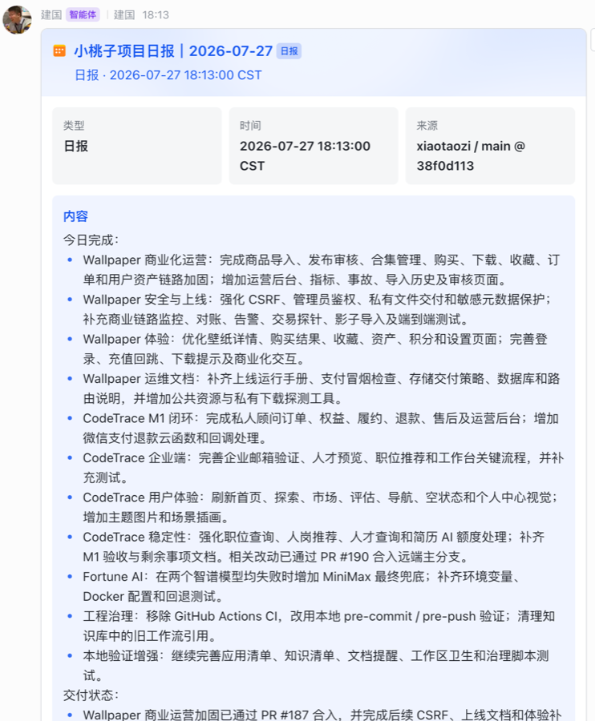
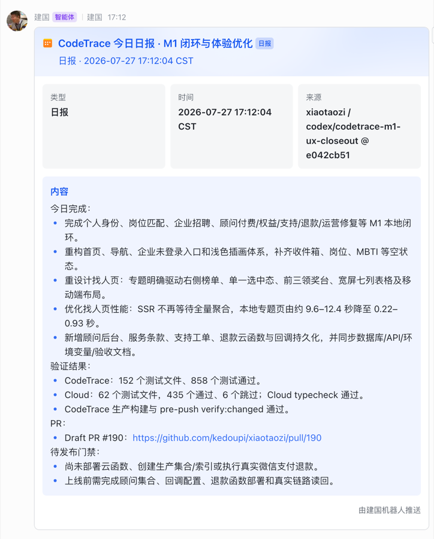
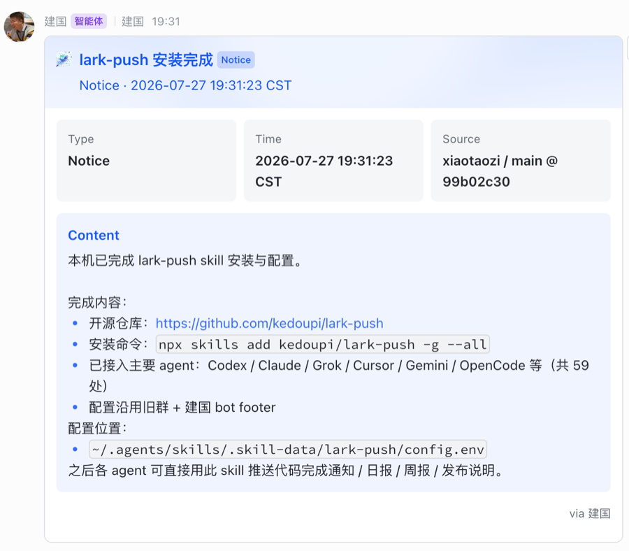

# lark-push

[English](./README.md) | [简体中文](./README.zh-CN.md)

从编码 Agent 向 **飞书 / Lark** 推送简洁通知。

支持 Claude Code、Codex、Cursor、OpenCode、Grok Build 以及 [70+ agents](https://github.com/vercel-labs/skills#supported-agents)，通过 [skills CLI](https://skills.sh/) 安装。

[](./LICENSE)
[](https://skills.sh/kedoupi/lark-push)
[](https://github.com/kedoupi/lark-push)

<p align="center">
  
</p>

## 为什么需要这个 skill？

编码 Agent 在终端里完成工作，团队协作却在 **飞书 / Lark**。  
`lark-push` 把两端接上：任务完成、日报、发布说明写好后，Agent 直接把 Card 2.0 卡片推到项目群——不用打开飞书客户端，也不用临时拼 API。

## 主要使用场景

| 场景 | Kind | 什么时候用 |
| --- | --- | --- |
| **代码任务完成** | `code` | 实现完成、测试通过、PR 打开 / 合并 |
| **日报 / 站会同步** | `daily` | 日终：今日完成、阻塞、明日计划 |
| **单产品线日更** | `daily` 或 `weekly` | 聚焦一条业务线（如 CodeTrace）的进展摘要 |
| **周报** | `weekly` | 本周重点、进展、风险、下周计划 |
| **发布 / 上线说明** | `release` | 版本上线、环境、回滚说明 |
| **运维 / 安装通知** | `notice` | skill 安装完成、配置变更、临时提醒 |
| **提交后自动通知**（可选） | `code` | 通过 git post-commit 钩子本地提交后推送 |

典型流程：

```text
Agent 完成工作
    → lark-push 组装 Card 2.0（标题、类型、时间、仓库上下文、正文）
    → 建国 / 你的机器人推到项目群
    → 同事不用再问「做完了吗」
```

## 截图

以下为真实推送到飞书群的 Card 2.0 消息。

### 项目日报

面向整个 monorepo 的日终多工作流汇总。


### 功能线日报

单产品线日更（进展、验证结果、PR、待发布门禁）。



### 安装 / 运维通知

本机完成 skill 安装与配置后的一次性通知。



## 功能

- 一条命令多 Agent 安装：`npx skills add kedoupi/lark-push`
- 默认 Card 2.0 交互卡片，也支持轻量 markdown
- 消息类型：`code` / `daily` / `weekly` / `release` / `notice`
- 配置跟随安装目录，且 **`npx skills update` 不会冲掉**
- 可选 git post-commit 钩子
- 基于官方 [`lark-cli`](https://github.com/larksuite/cli)

## 安装

```bash
# 全局安装到所有支持的 agent（推荐）
npx skills add kedoupi/lark-push -g --all

# 仅当前项目
npx skills add kedoupi/lark-push --all

# 指定 agent
npx skills add kedoupi/lark-push -g -a claude-code -a codex -a cursor -y

# 使用 copy 模式（不用 symlink）
npx skills add kedoupi/lark-push -g --all --copy
```

只查看仓库内 skill，不安装：

```bash
npx skills add kedoupi/lark-push --list
```

在 [skills.sh](https://skills.sh/kedoupi/lark-push) 浏览。

## 前置条件

| 需要 | 用途 | 如何安装 |
| --- | --- | --- |
| **Node.js + npm** | `npx skills add`；通常也用 npm 装 `lark-cli` | [nodejs.org](https://nodejs.org/) LTS 或 `brew install node` |
| **lark-cli** | 真正向飞书/Lark 发消息 | `npm install -g @larksuite/cli` — [文档](https://github.com/larksuite/cli) |
| **python3** | 默认 Card 2.0 卡片 | macOS: `brew install python3`（或改用 `--format markdown`） |
| **会话 ID** | 发到哪个群 | 飞书群的 `oc_xxx` |

工具就绪后：

```bash
# 飞书 CLI 鉴权 / 应用配置
LARKSUITE_CLI_NO_UPDATE_NOTIFIER=1 LARKSUITE_CLI_NO_SKILLS_NOTIFIER=1 \
  lark-cli auth status --json --verify

# 一键体检（缺什么会打印安装提示）
bash ~/.agents/skills/lark-push/scripts/lark-push doctor
```

若没有 `npx`，请先安装 Node——本 skill **不自带** Node 或 `lark-cli`。

## 快速开始

```bash
# 0) 环境体检（安装后建议先跑）
bash ~/.agents/skills/lark-push/scripts/lark-push doctor

# 1) 安装后一次性配置（持久、update 安全）
bash ~/.agents/skills/lark-push/scripts/lark-push init --chat-id oc_xxxxxxxx

# 可选身份 / 页脚
bash ~/.agents/skills/lark-push/scripts/lark-push init \
  --chat-id oc_xxxxxxxx \
  --as bot \
  --footer "via 我的机器人" \
  --force

# 2) 预览
bash ~/.agents/skills/lark-push/scripts/lark-push \
  --dry-run \
  --kind code \
  --title "代码任务完成" \
  --body "实现完成，本地验证通过。"

# 3) 正式发送
bash ~/.agents/skills/lark-push/scripts/lark-push \
  --kind code \
  --title "代码任务完成" \
  --body "实现完成，本地验证通过。"
```

## 配置说明

### 为什么不能只把配置放在 skill 包内？

`npx skills update` 会 **删除并重新拷贝** skill 包目录。  
本地配置不能只写在包内部。

### 推荐持久路径

配置放在 skill 安装目录的旁路数据区：

```text
~/.agents/skills/
  lark-push/                 # skill 包（update 会 wipe）
  .skill-data/
    lark-push/
      config.env             # 持久配置（update 保留）
```

### 安装模式

| 模式 | 布局 | 配置 |
| --- | --- | --- |
| **symlink**（默认） | 真文件在 `~/.agents/skills/lark-push/`，各 agent 软链 | 一份 durable 配置全 agent 共用 |
| **copy**（`--copy`） | 每个 agent 独立拷贝 | 每份拷贝各自一份，或用 `--target global` 共享 |

### 加载顺序（后覆盖前）

1. `~/.config/lark-push/config.env`（旧路径兼容）
2. `~/.agents/skills/.skill-data/lark-push/config.env`（全局共享）
3. `<skills-parent>/.skill-data/lark-push/config.env`（安装位置 durable）
4. `<skill-root>/config.local.env`（包内临时，update 会丢）
5. `$LARK_PUSH_CONFIG`
6. CLI 参数

| 变量 | 默认 | 说明 |
| --- | --- | --- |
| `LARK_PUSH_CHAT_ID` | _(必填)_ | 目标会话 ID |
| `LARK_PUSH_AS` | `bot` | `bot` 或 `user` |
| `LARK_PUSH_FOOTER` | `via lark-push` | 卡片页脚 |
| `LARK_PUSH_CONFIG` | _(空)_ | 显式指定 env 文件路径 |

查看：

```bash
bash ~/.agents/skills/lark-push/scripts/lark-push config-path
bash ~/.agents/skills/lark-push/scripts/lark-push which-config
```

## 使用示例

```bash
# 从 stdin 发送日报
cat daily.md | bash ~/.agents/skills/lark-push/scripts/lark-push \
  --kind daily \
  --title "今日日报"

# 从文件发送周报
bash ~/.agents/skills/lark-push/scripts/lark-push \
  --kind weekly \
  --title "本周周报" \
  --from-file weekly.md

# 临时覆盖目标群
bash ~/.agents/skills/lark-push/scripts/lark-push \
  --chat-id oc_other \
  --kind notice \
  --title "提醒" \
  --body "发布窗口 30 分钟后开始。"
```

### 消息类型

| Kind | 用途 |
| --- | --- |
| `code` | 代码完成、测试结果、PR / 发布状态 |
| `daily` | 日报 |
| `weekly` | 周报 |
| `release` | 上线 / 发布说明 |
| `notice` | 一般通知 |

### 输出格式

| Format | 用途 |
| --- | --- |
| `card` | 默认；飞书 Card 2.0 |
| `markdown` | 轻量 markdown |

### CLI 参数

```text
--kind <code|daily|weekly|release|notice>
--format <card|markdown>
--title <text>
--body <text>
--from-file <path>
--chat-id <oc_xxx>
--as <bot|user>
--idempotency-key <key>
--dry-run                   # local preview only
--idempotency-key <key>      # max 50 chars
--no-context
```

## 可选：git post-commit 钩子

请用 **软链接**（不要复制文件），以便钩子能解析到 skill 脚本：

```bash
ln -sf ~/.agents/skills/lark-push/scripts/git-post-commit-lark-push \
  .git/hooks/post-commit
```

请先执行 `lark-push init`。

临时关闭（无需删除钩子）：

```bash
export LARK_PUSH_GIT_HOOK=0
```

## Agent 安全约定

消息会出现在群里。Agent 发送真实消息前应确认：

- 目标群 / 会话
- 消息内容
- 发送身份（`bot` / `user`）

预览用 `--dry-run`（仅本地，不调网络/钥匙串）。用户直接执行脚本视为已授权。

## 仓库结构

```text
skills/
  lark-push/
    SKILL.md                 # Agent skill 定义
    config.example.env
    scripts/
      lark-push              # 主 CLI
      build_card.py          # Card 2.0 JSON 构建
      git-post-commit-lark-push
    templates/
      daily.md
      weekly.md
tests/
  run.sh
docs/
  screenshots/               # README 使用的飞书卡片截图
README.md                    # 英文（默认）
README.zh-CN.md              # 中文
LICENSE
```

兼容 `npx skills add <owner/repo>` 发现机制。

## 本地开发

```bash
git clone https://github.com/kedoupi/lark-push.git
cd lark-push

# 离线自测（不碰钥匙串 / 网络）
bash tests/run.sh

# 从本地路径列出 skill
npx skills add ./ --list

# 从本地检出安装
npx skills add ./ -g --all -y

# dry-run（仅本地预览）
bash skills/lark-push/scripts/lark-push \
  --dry-run \
  --chat-id oc_example \
  --kind code \
  --title "Test" \
  --body "- hello"
```

用 coding agent 改本仓库时见 [AGENTS.md](./AGENTS.md)。

## 排查

```bash
# 环境体检 + 安装提示
bash ~/.agents/skills/lark-push/scripts/lark-push doctor

# 鉴权
LARKSUITE_CLI_NO_UPDATE_NOTIFIER=1 LARKSUITE_CLI_NO_SKILLS_NOTIFIER=1 \
  lark-cli auth status --json --verify

# 当前生效配置
bash ~/.agents/skills/lark-push/scripts/lark-push which-config
```

发送失败时：

1. 确认 durable 配置存在且 chat id 正确
2. 确认机器人在目标群且有发言权限
3. 确认 `lark-cli` 具备 IM 发消息 scope

## 许可证

[MIT](./LICENSE)

## 链接

- GitHub：https://github.com/kedoupi/lark-push
- skills.sh：https://skills.sh/kedoupi/lark-push
- skills CLI：https://github.com/vercel-labs/skills
- lark-cli：https://github.com/larksuite/cli
